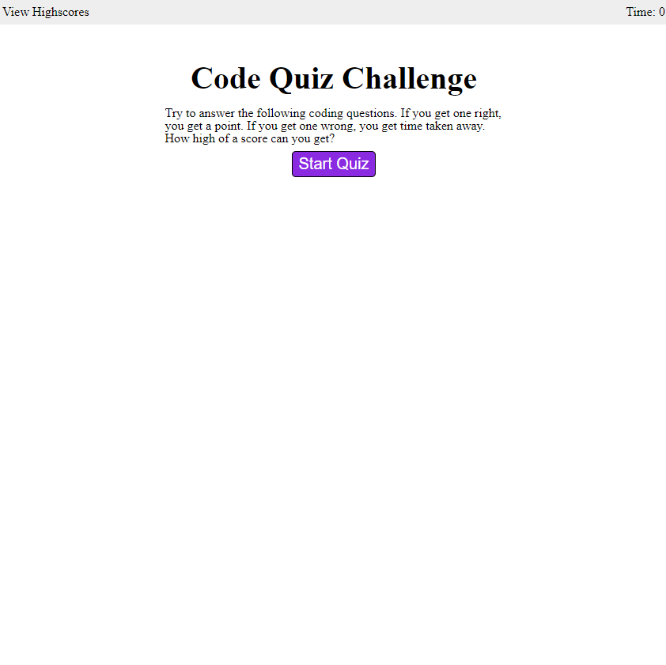

# Code Quiz

## Description

Here's a quiz that will challenge what you know about the basics of web developement.

I built this challenge to bring together what I learned about HTML, CSS and JavaScript.
I primarily learned about bug fixing. I also learned a bit about how to identify what scope to put different variables in.

## Installation

N/A

## Usage

To begin the quiz, press the "Start Quiz" button. You'll be presented with a series of multiple choice quesitons about web developement. Chose the right answer, you get a point added to your score. Chose the wrong answer, however, and you'll see your timer drop. After either your timer drops to 0 or you run out of questions, your score will be revealed to you. Write your initials down and submit your score for the leaderboard. If you want to reset the leaderboard, feel free to do so when you're viewing it.

